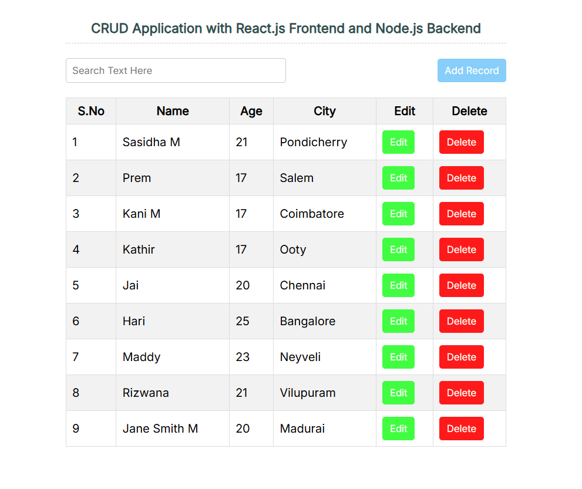

CRUD application using react frontend & node js backend

A **CRUD Application** using **React** for the frontend and **Node.js**
for the backend is a full-stack web application that allows users to
**Create**, **Read**, **Update**, and **Delete** data.

**Project Overview**

-   **Frontend**: Built with React, it handles the user interface where
    users can interact with the application (e.g., input forms, data
    display, and updates).

-   **Backend**: Developed using Node.js and Express, it manages the
    server-side logic, handles API requests, and communicates with a
    database (e.g., MongoDB or MySQL) to perform CRUD operations.

**Key Features**

-   **Create**: Users can add new records to the database.

-   **Read**: Users can view existing records from the database.

-   **Update**: Users can modify existing records.

-   **Delete**: Users can remove records from the database.

**Tech Stack**

-   **Frontend**: React.js, Axios for API requests.

-   **Backend**: Node.js, Express, MongoDB (or any other database).

-   **Tools**: Postman (for API testing), Visual Studio Code.

**Process**

1.  **Frontend (React)**: React handles user input, displays data, and
    interacts with the backend through RESTful APIs.

2.  **Backend (Node.js)**: Node.js with Express serves as the API
    server, processing requests and performing database CRUD operations.

This project helps to build a robust understanding of full-stack web
development by integrating frontend and backend technologies.

